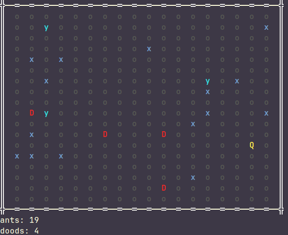

# CS3520 - PA04 - Predator or Prey

Developer Name: _Harrison Eckert_

## How to Run the Program

_Compile this program using CMake, then from the `cmake-build-debug` folder,
run `./PredOrPrey`_

## Notes to TAs

_Configuration details can be changed in `main.cpp`, in the construction
of the Simulation object_

_For better visuals, run in a Linux terminal, and not the CLion terminal._

_To disable the clearing of the screen after each tick, set `const bool CLEAR_SCREEN` 
at the top of [Simulation.h](/lib/include/Simulation.h) to `false`_

